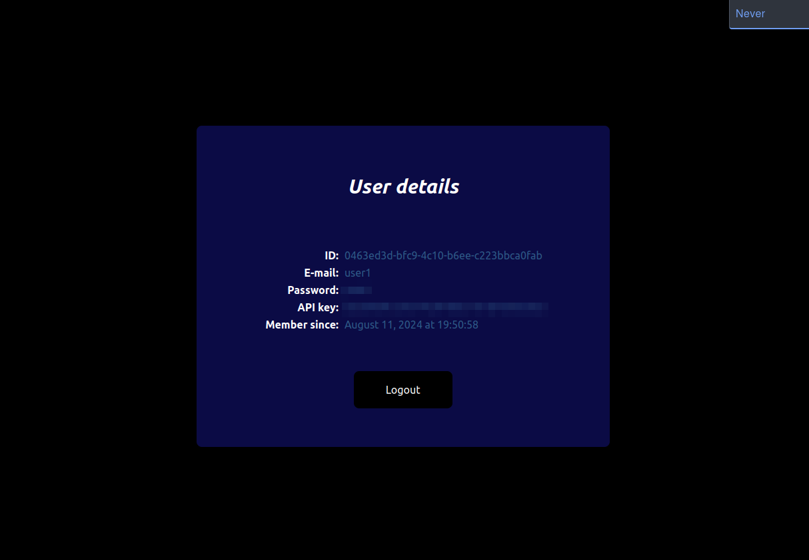

# user-dashboard

This project aims at providing a simple dashboard to manage a user account on [gasteropo.de](https://gasteropo.de). It is the website attached to the [user-service](https://github.com/Knoblauchpilze/user-service) backend service.

Below are some screenshots of how the website looks like:




# Badges

[](https://github.com/Knoblauchpilze/user-dashboard/actions/workflows/build-and-push.yml)

[](https://codecov.io/gh/Knoblauchpilze/user-dashboard)

# Installation

## Prerequisites

This project requires the following tools to be installed on your machine:
* [node](https://nodejs.org/en/download)
* [docker](https://docs.docker.com/engine/install/ubuntu/) (for Ubuntu, but can be adapted for other OS)

## Setup the repository

Once this is done, you can clone the repository locally:

```bash
git clone git@github.com:Knoblauchpilze/user-dashboard.git
```

After this you can install the dependencies and start the preview of the website:
```bash
cd /path/to/the/repo
make instal
make dev
```

This should open a new tab in your browser with the website.

## Additional information

This project was generated from the [template-frontend](https://github.com/Knoblauchpilze/template-frontend) project. It also uses the [frontend-toolkit](https://github.com/Knoblauchpilze/frontend-toolkit) to interact with the backend service.

# What is the goal of this project?

## Context

This project was initially integrated in the [galactic-sovereign](https://github.com/Knoblauchpilze/galactic-sovereign) project as a toy project to deploy on the website. As the project developed, some components were extracted and the monorepo approach that was initially followed showed some limitations.

To improve the situation this project (along some other services) was extracted to a dedicated repository.

## Future development

Currently the project is very limited and does not allow users to manage anything. It just displays the information that was submitted when signing up. It would be nice if the project would turn into a real user-dashboard where users of the [gasteropo.de](https://gasteropo.de) website would be able to control the multiple accounts they have on the website.
